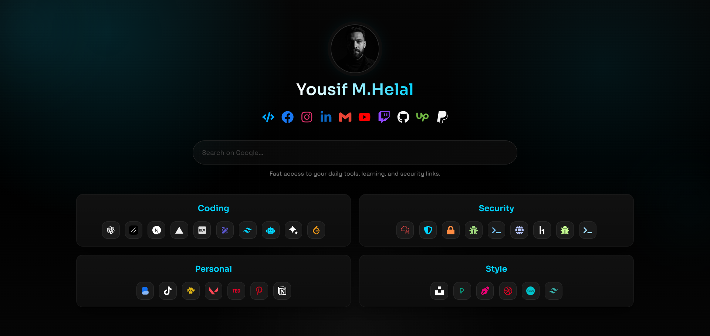

# 🏠 Google Home Page Clone

A beautiful, modern personal homepage built with React and Tailwind CSS. This project recreates a Google-inspired landing page with quick access to frequently used tools, learning resources, and security-focused platforms organized by category.



## ✨ Features

- **Profile Section**: Display personal information with social media links
  - Portfolio link
  - Social profiles (Facebook, Instagram, LinkedIn)
  - Email and messaging links (Gmail, Upwork, PayPal)
  - GitHub and other development platforms

- **Google Search Integration**: Built-in search bar that redirects to Google Search
  - Auto-focused for quick searching
  - Fully functional search redirection

- **Organized Link Categories**: Quick access to tools organized in a 2x2 grid:

  **Coding** - Development tools and resources
  - ChatGPT, React Docs, shadcn/ui, Next.js
  - Vercel, DEV, Excalidraw, Tailwind Docs
  - Claude Code, Gemini, LeetCode

  **Security** - Cybersecurity learning and platforms
  - TryHackMe, Hack The Box, PortSwigger Academy
  - OWASP Top 10, CTFtime, NVD
  - HackerOne Hacktivity, CVE Details, Exploit DB

  **Personal** - Entertainment and learning platforms
  - Busuu, TikTok, Monkeytype, Valorant
  - TED, Pinterest, Notion

  **Style** - Design and media resources
  - Unsplash, Pexels, Wallpaper, Dribbble, Canva

- **Modern Design**:
  - Dark theme with cyan accents
  - Animated gradient background with orb effects
  - Responsive layout
  - Custom typography (Sora & Space Grotesk fonts)
  - Smooth hover interactions

## 🛠️ Tech Stack

- **React** 18.2.0 - UI framework
- **Tailwind CSS** 3.3.2 - Utility-first CSS framework
- **React Icons** 4.12.0 - Icon library (Font Awesome, Heroicons, etc.)
- **React Scripts** 5.0.1 - Build and development scripts
- **gh-pages** 5.0.0 - GitHub Pages deployment

## 📦 Installation

1. **Clone the repository**
   ```bash
   git clone <repository-url>
   cd My-google-home-page
   ```

2. **Install dependencies**
   ```bash
   npm install
   ```

3. **Start the development server**
   ```bash
   npm start
   ```
   The app will open at `http://localhost:3000`

## 🚀 Available Scripts

- `npm start` - Run the development server
- `npm build` - Build the app for production
- `npm test` - Run the test suite
- `npm run deploy` - Deploy to GitHub Pages (requires gh-pages setup)
- `npm run eject` - Eject from Create React App (irreversible)

## 🎨 Customization

### Update Profile Information
Edit the profile section in [src/App.js](src/App.js):
- Replace `profile.jpeg` with your profile image
- Update social media links in the `top-links` section
- Change the profile title

### Add or Remove Links
Modify the `CategorySection` component in [src/App.js](src/App.js):
- Add new link objects to the icon arrays
- Remove links by deleting the object
- Update icons and colors as needed

### Change Theme Colors
Edit the CSS variables in [src/index.css](src/index.css):
- `--color-accent` - Primary accent color
- `--color-bg` - Background color
- `--color-text` - Text color
- Modify the gradient backgrounds

### Tailwind Configuration
Customize styles in [tailwind.config.js](tailwind.config.js) for extended theme options and custom utilities.

## 📁 Project Structure

```
├── public/
│   ├── index.html              # Main HTML file
│   └── favicon.ico             # Browser tab icon
├── src/
│   ├── App.js                  # Main app component with all links
│   ├── index.js                # React entry point
│   ├── index.css               # Global styles and CSS variables
│   ├── profile.jpeg            # Profile image
│   ├── [other-images]          # Logo images for links
├── tailwind.config.js          # Tailwind CSS configuration
├── package.json                # Project dependencies and scripts
└── README.md                   # This file
```

## 🌐 Deployment

### Deploy to GitHub Pages

1. **Update package.json** (already configured):
   ```json
   "homepage": "https://yousifmhelal.github.io/My-google-home-page"
   ```

2. **Deploy**:
   ```bash
   npm run deploy
   ```

The app will be built and deployed to the `gh-pages` branch on GitHub.

### Deploy to Other Platforms

The `npm run build` command creates a production-ready build in the `build/` folder that can be deployed to:
- Vercel
- Netlify
- Any static hosting service

## 📝 Notes

- All external links open in new tabs with `target="_blank"`
- The search bar is auto-focused for quick searching
- Icons are fetched from various icon libraries via react-icons
- Images (profile, logos) are imported locally for better performance
- Fully responsive design works on mobile, tablet, and desktop

## 🎯 Browser Support

- Chrome (latest)
- Firefox (latest)
- Safari (latest)
- Edge (latest)

## 📄 License

This project is private and maintained by Yousif M. Helal. Feel free to customize it for your own use.

## 🤝 Contributing

This is a personal project. For modifications, simply edit the files as described in the Customization section.

---

**Happy browsing! 🚀**
